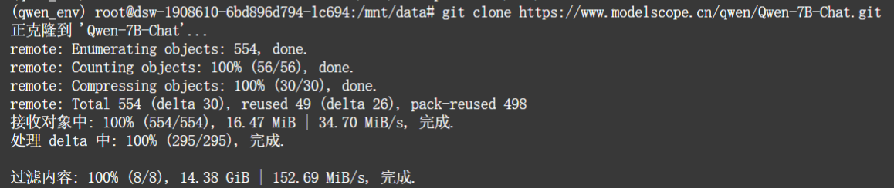
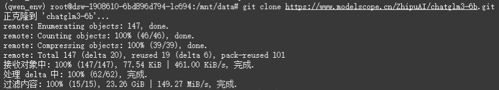
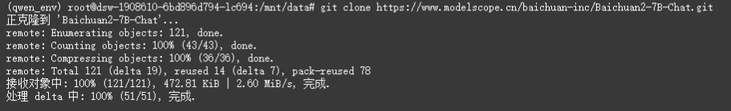
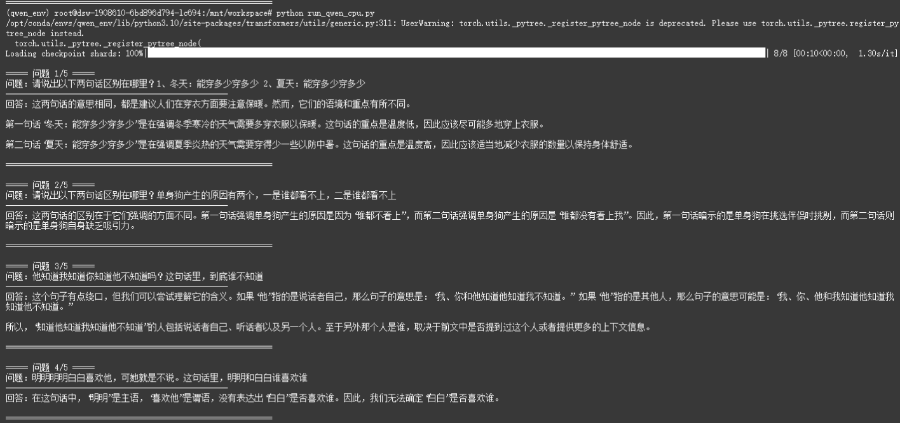
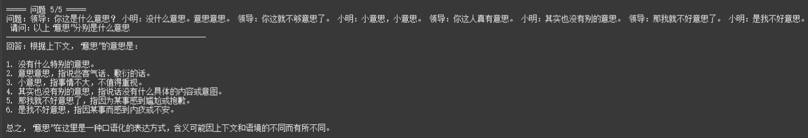
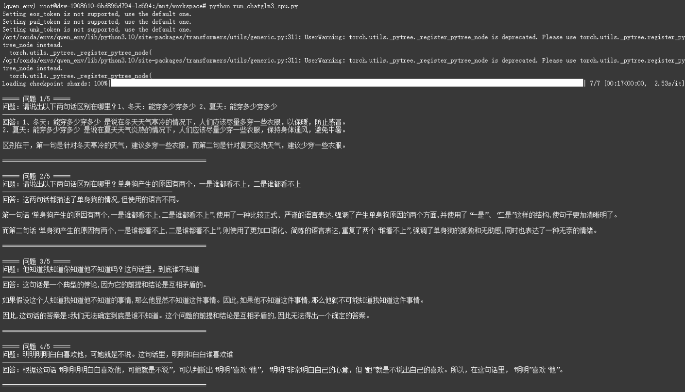
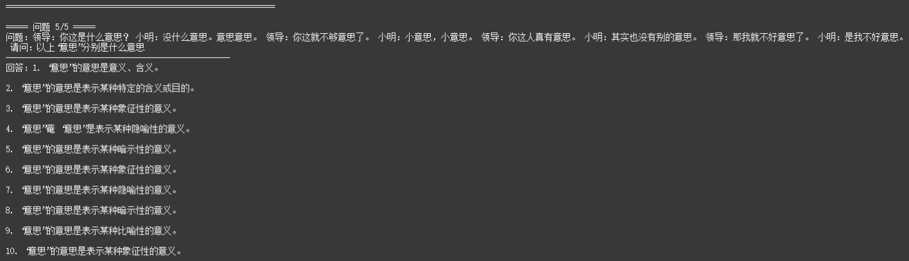
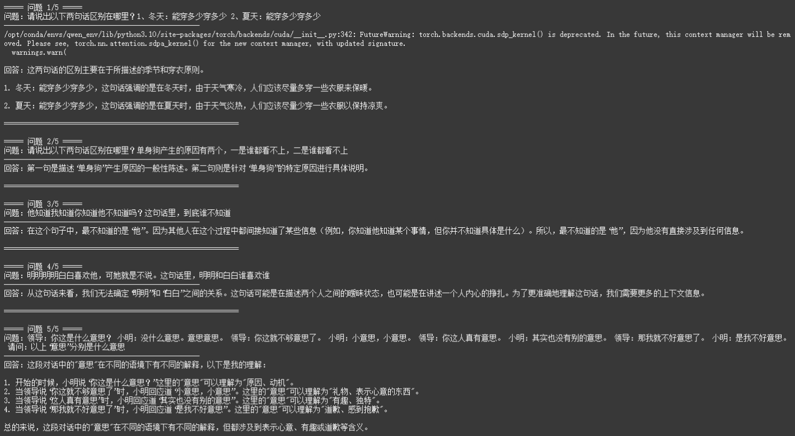

# 人工智能导论第三次作业
## 大模型部署体验

### 一、实验目的
1. 掌握 ModelScope 平台免费 CPU 环境搭建流程
2. 完成 Conda 环境与深度学习依赖安装
3. 本地下载并部署三个中文开源大模型
4. 对5条典型中文歧义句进行问答测试
5. 横向对比模型理解能力、稳定性、CPU 运行效率
6. 项目上传 GitHub，提供公开访问链接

### 二、实验环境搭建
#### 1. 平台注册与资源获取
- 注册并登录：https://www.modelscope.cn
- 绑定阿里云账号，领取免费 CPU 资源（8核32G）
- 启动 CPU 实例，进入 Notebook，打开 Terminal

#### 2. 安装 Conda
```bash
cd /opt/conda/envs
wget https://repo.anaconda.com/miniconda/Miniconda3-latest-Linux-x86_64.sh
bash Miniconda3-latest-Linux-x86_64.sh -b -p /opt/conda
echo 'export PATH="/opt/conda/bin:$PATH"' >> ~/.bashrc
source ~/.bashrc
conda --version
```
#### 3. 安装 Conda
```bash
conda create -n qwen_env python=3.10 -y
source /opt/conda/etc/profile.d/conda.sh
conda activate qwen_env
```
#### 4.安装 CPU 版 PyTorch
```bash
pip install \
torch==2.3.0+cpu \
torchvision==0.18.0+cpu \
--index-url https://download.pytorch.org/whl/cpu
```
#### 5. 安装全部依赖
```bash
pip install -U pip setuptools wheel
pip install \
"intel-extension-for-transformers==1.4.2" \
"neural-compressor==2.5" \
"transformers==4.33.3" \
"modelscope==1.9.5" \
"pydantic==1.10.13" \
sentencepiece \
tiktoken \
einops \
transformers_stream_generator \
uvicorn \
fastapi \
yacs \
setuptools_scm

pip install fschat --use-pep517
pip install accelerate
pip install tqdm huggingface-hub
```
### 三、下载开源大模型
```bash
cd /mnt/data

# Qwen-7B-Chat
git clone https://www.modelscope.cn/qwen/Qwen-7B-Chat.git

# ChatGLM3-6B
git clone https://www.modelscope.cn/ZhipuAI/chatglm3-6b.git

# Baichuan2-7B-Chat
git clone https://www.modelscope.cn/baichuan-inc/Baichuan2-7B-Chat.git
```
克隆截图:
1.Qwen

2.chatglm3-6B

3.Baichuan2-7B


### 四、测试问题列表
1.请说出以下两句话区别在哪里？1、冬天：能穿多少穿多少 2、夏天：能穿多少穿多少
2.请说出以下两句话区别在哪里？单身狗产生的原因有两个，一是谁都看不上，二是谁都看不上
3.他知道我知道你知道他不知道吗？这句话里，到底谁不知道
4.明明明明白白喜欢他，可她就是不说。这句话里，明明和白白谁喜欢谁
5.领导：你这是什么意思？ 小明：没什么意思。意思意思。 领导：你这就不够意思了。 小明：小意思，小意思。 领导：你这人真有意思。 小明：其实也没有别的意思。 领导：那我就不好意思了。 小明：是我不好意思。 请问：以上 “意思” 分别是什么意思

### 五、测试结果
1.Qwen


2.chatglm3-6B


3.Baichuan2-7B


### 六、模型对比分析
#### 1.单题表现详细对比
| 问题编号 | 核心考点 | Qwen-7B-Chat | ChatGLM3-6B | Baichuan2-7B-Chat |
|----------|----------|--------------|-------------|-------------------|
| 1 | 语境依赖的语义反转（"多少"） | ✅ 正确，清晰解释冬夏语境下"多少"的相反含义 | ✅ 正确，准确区分冬夏穿衣建议的差异 | ✅ 正确，简洁明了地指出季节与穿衣原则的对应关系 |
| 2 | 施受关系歧义（主动/被动） | ✅ 正确，精准区分"我看不上别人"（主动挑剔）和"别人看不上我"（被动被嫌弃） | ❌ 完全错误，将同一语句的两种歧义误解为"正式表达vs口语表达"的风格差异 | ❌ 完全错误，将歧义误解为"一般性陈述vs具体说明"的概括性差异 |
| 3 | 多层嵌套知识句的逻辑推理 | ❌ 完全错误，逻辑混乱，将"他不知道"错误解读为"我不知道"，还引入不必要的指代歧义 | ❌ 错误，误将清晰的嵌套逻辑判定为"悖论"，声称无法得出确定结论 | ✅ 正确，准确推理出最终不知道的人是"他"，逻辑清晰 |
| 4 | 断句分词歧义（人名vs副词） | ❌ 错误，将副词"明明白白"错误拆分为"明明"+"白白"两个人名 | ✅ 正确，准确断句为"明明/明明白白/喜欢他"，指出"明明白白"是副词 | ❌ 错误，同样将"明明白白"拆分为两个人名，误解为两人之间的暧昧关系 |
| 5 | 口语多义词的语境理解（"意思"） | ❌ 不完整且错误，仅解释6个"意思"，漏掉4个关键含义；将"意思意思"（送礼）错误解释为"敷衍的话" | ❌ 完全错误，所有10个"意思"都用"象征性意义""隐喻性意义"等空泛套话解释，无任何具体内容 | ❌ 不完整且错误，仅解释4个"意思"，漏掉6个；将"不够意思"（不懂人情）错误解释为"礼物" |

#### 2、核心能力维度对比

##### 2.1. 基础语境语义理解能力
- **表现**：三个模型全部达标
- **分析**：在简单的语境依赖语义（如"多少"在冬夏的反转含义）上，三个模型都能准确理解，说明它们的基础中文语义理解能力已经比较成熟。

##### 2.2 施受关系歧义拆解能力
- **Qwen-7B-Chat**：**优秀**，是唯一能准确区分"谁都看不上"主动/被动两种含义的模型
- **ChatGLM3-6B/Baichuan2-7B-Chat**：**极差**，完全无法识别无标记的施受关系歧义，暴露出中文句法分析的根本性缺陷

##### 2.3 嵌套逻辑推理能力
- **Baichuan2-7B-Chat**：**优秀**，能正确解析三层嵌套的知识句，准确追踪信息传递链条
- **Qwen-7B-Chat**：**极差**，逻辑完全混乱，错误反转了"知道"和"不知道"的主体
- **ChatGLM3-6B**：**极差**，将清晰的逻辑结构误判为悖论，说明其处理复杂嵌套信息的能力不足

##### 2.4 断句分词歧义处理能力
- **ChatGLM3-6B**：**优秀**，能正确区分人名"明明"和副词"明明白白"，分词和断句能力突出
- **Qwen-7B-Chat/Baichuan2-7B-Chat**：**极差**，在连续相同字组成的词汇与人名边界模糊时，容易错误切分，导致完全误解句意

##### 2.5 口语化多义词理解能力
- **整体表现**：三个模型**全部不及格**，这是7B/6B级小模型的普遍短板
- **ChatGLM3-6B**：最差，完全无法理解"意思"的任何具体语境含义
- **Qwen-7B-Chat/Baichuan2-7B-Chat**：能理解部分含义，但都非常不完整，且存在多处不准确的解释
- **原因分析**：训练数据中口语化对话的覆盖不足，模型未能学会将多义词与具体语境进行精细关联

#### 3、典型错误类型总结

1. **句法分析缺陷**
   - 无法处理无标记的施受关系（ChatGLM3、Baichuan2）
   - 分词断句错误，将普通词汇误拆为人名（Qwen、Baichuan2）

2. **逻辑推理能力不足**
   - 无法处理多层嵌套的逻辑结构（Qwen、ChatGLM3）
   - 错误将清晰的逻辑问题判定为悖论（ChatGLM3）

3. **口语化表达理解缺失**
   - 对高度依赖语境的多义词理解能力极差
   - 无法区分同一词汇在不同社交场景下的细微含义差异

4. **回答完整性问题**
   - 处理长文本中的多个相同词汇时，容易遗漏部分内容（Qwen、Baichuan2）
   - 倾向于用空泛套话代替具体解释（ChatGLM3）

#### 4、综合排名与使用建议

##### 综合排名（按错误严重程度从低到高）
1. **Qwen-7B-Chat**：在施受关系歧义上表现突出，错误相对较少且不那么致命
2. **Baichuan2-7B-Chat**：在嵌套逻辑推理上有优势，但其他方面错误较多
3. **ChatGLM3-6B**：在断句分词上有优势，但在施受关系和口语多义词上表现极差

##### 场景化使用建议
- **处理中文句法歧义（尤其是施受关系）**：优先选择 **Qwen-7B-Chat**
- **处理断句分词歧义（尤其是人名识别）**：优先选择 **ChatGLM3-6B**
- **处理复杂嵌套逻辑问题**：优先选择 **Baichuan2-7B-Chat**
- **处理大量口语化对话和多义词**：不建议使用7B/6B级模型，建议升级到13B及以上参数规模，或进行针对性微调

#### 5、局限性说明
本次测试仅针对5道特定的中文歧义理解题，模型的表现可能会因测试集的不同而有所差异。7B/6B级模型作为轻量级模型，在复杂中文理解任务上存在天然的能力上限。


